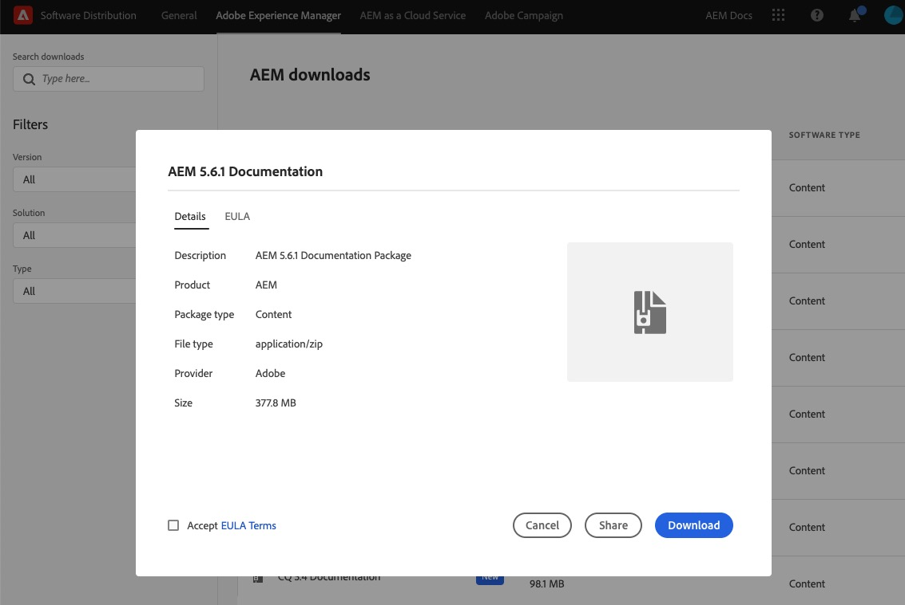

# [!DNL Adobe Experience Manager]、CQ および CRX の以前のバージョンのドキュメント {#older-versions-aem-cq-crx}

AEM、CQ および CRX の以前のバージョンに関する以前のヘルプガイドを参照してください。

## [!DNL Experience Manager] ドキュメントの以前のバージョン {#older-version-aem-documentation}

このページにリストされている [!DNL Adobe Experience Manager]、 CQ および CRX のバージョンは、提供が終了しており、アドビによる公式販売は行われなくなりました。 これらの以前のバージョンについては、アドビによる公式ドキュメントの最終版をセルフヘルプ用に利用できます。 最新バージョンである [[!DNL Adobe Experience Manager] as a Cloud Service](https://experienceleague.adobe.com/ja/docs/experience-manager-cloud-service) にアップグレードすることをお勧めします。

>[!NOTE]
>
>[!DNL Experience Manager] バージョンのコアサポートが終了する時期を確認するには、[製品とテクニカルサポート期間](https://helpx.adobe.com/jp/support/programs/eol-matrix.html)を参照して、`AEM` を検索してください。

### インストールの前に {#before-installation}

パッケージをダウンロードする前に、誰がコンテンツを使用するかを決めます。 この決定により、デプロイ方法が決まります。

* 開発者は、クイックリファレンス用としてローカルにインストールできます。
* 組織の幅広いドキュメントニーズに対応するには、内部でアクセス可能な、実稼動以外の AEM オーサーインスタンスにパッケージをデプロイすることをお勧めします。

>[!NOTE]
>
>[!DNL Experience Manager] オーサー環境のこのコンテンツにアクセスするには、ユーザーは [!DNL Experience Manager] インスタンスにログインする必要があります。 このコンテンツは、デフォルトでは、AEM Publish ではアクセスできません（/libs 以下に存在するため）。

## ソフトウェア配布場所 {#software-distribution-locations}

有効な Adobe ID が必要です。

* Adobe ID がない場合は、https://www.adobe.com/jp/ で作成できます。
Adobe ID の作成や管理に関してサポートが必要な場合は、[このガイドを参照してください](https://helpx.adobe.com/jp/manage-account.html)

| [!DNL Experience Manager] バージョン | ソフトウェア配布リンク |
|:-----------:|:--------------------------------------------------:|
| [!DNL Experience Manager] 6.4 | [Adobe Experience Manager 6.4 ドキュメント](https://experienceleague.adobe.com/ja/docs/experience-manager-64) |
| [!DNL Experience Manager] 6.3 | [ソフトウェア配布から AEM-DOCS-6.3 をダウンロード](https://experience.adobe.com/#/downloads/content/software-distribution/en/aem.html?package=/content/software-distribution/en/details.html/content/dam/aem/public/adobe/packages/aem-docs/aem-docs-6-3.zip) |
| [!DNL Experience Manager] 6.2 | [ソフトウェア配布から AEM-DOCS-6.2 をダウンロード](https://experience.adobe.com/#/downloads/content/software-distribution/en/aem.html?package=/content/software-distribution/en/details.html/content/dam/aem/public/adobe/packages/aem-docs/aem-docs-6-2.zip) |
| [!DNL Experience Manager] 6.1 | [ソフトウェア配布から AEM-DOCS-6.1 をダウンロード](https://experience.adobe.com/#/downloads/content/software-distribution/en/aem.html?package=/content/software-distribution/en/details.html/content/dam/aem/public/adobe/packages/aem-docs/aem-docs-6-1.zip) |
| [!DNL Experience Manager] 6.0 | [ソフトウェア配布から AEM-DOCS-6.0 をダウンロード](https://experience.adobe.com/#/downloads/content/software-distribution/en/aem.html?package=/content/software-distribution/en/details.html/content/dam/aem/public/adobe/packages/aem-docs/aem-docs-6-0.zip) |
| [!DNL Experience Manager] 5.6.1 | [ソフトウェア配布から AEM-DOCS-5.6.1 をダウンロード](https://experience.adobe.com/#/downloads/content/software-distribution/en/aem.html?package=/content/software-distribution/en/details.html/content/dam/aem/public/adobe/packages/aem-docs/aem-docs-5-6-1.zip) |
| [!DNL Experience Manager] 5.6 | [ソフトウェア配布から AEM-DOCS-5.6 をダウンロード](https://experience.adobe.com/#/downloads/content/software-distribution/en/aem.html?package=/content/software-distribution/en/details.html/content/dam/aem/public/adobe/packages/aem-docs/aem-docs-5-6.zip) |
| CQ 5.5 | [ソフトウェア配布から CQ-DOCS-5.5 をダウンロード](https://experience.adobe.com/#/downloads/content/software-distribution/en/aem.html?package=%2Fcontent%2Fsoftware-distribution%2Fen%2Fdetails.html%2Fcontent%2Fdam%2Faem%2Fpublic%2Fadobe%2Fpackages%2Faem-docs%2Faem-docs-5-5.zip) |
| CQ 5.4 | [ソフトウェア配布から CQ-DOCS-5.4 をダウンロード](https://experience.adobe.com/#/downloads/content/software-distribution/en/aem.html?package=/content/software-distribution/en/details.html/content/dam/aem/public/adobe/packages/aem-docs/aem-docs-5-4.zip) |
| CQ 5.3 | [ソフトウェア配布から CQ-DOCS-5.3 をダウンロード](https://experience.adobe.com/#/downloads/content/software-distribution/en/aem.html?package=/content/software-distribution/en/details.html/content/dam/aem/public/adobe/packages/aem-docs/aem-docs-5-3.zip) |
| CRX 2.3 | [ソフトウェア配布から CRX-DOCS-2.3 をダウンロード](https://experience.adobe.com/#/downloads/content/software-distribution/en/aem.html?package=/content/software-distribution/en/details.html/content/dam/aem/public/adobe/packages/aem-docs/crx-docs-2-3.zip) |
| CRX 2.2 | [ソフトウェア配布から CRX-DOCS-2.2 をダウンロード](https://experience.adobe.com/#/downloads/content/software-distribution/en/aem.html?package=/content/software-distribution/en/details.html/content/dam/aem/public/adobe/packages/aem-docs/crx-docs-2-2.zip) |
| CRX 2.1 | [ソフトウェア配布から CRX-DOCS-2.1 をダウンロード](https://experience.adobe.com/#/downloads/content/software-distribution/en/aem.html?package=/content/software-distribution/en/details.html/content/dam/aem/public/adobe/packages/aem-docs/crx-docs-2-1.zip) |
| CRX 2.0 | [ソフトウェア配布から CRX-DOCS-2.0 をダウンロード](https://experience.adobe.com/#/downloads/content/software-distribution/en/aem.html?package=/content/software-distribution/en/details.html/content/dam/aem/public/adobe/packages/aem-docs/crx-docs-2-0.zip) |

## ドキュメントパッケージのインストール方法 {#how-to-install-documentation-package}

従来のドキュメントパッケージをインストールするには、ローカルドライブまたはネットワークドライブに [!DNL Experience Manager] をインストールして実行する必要があります。

### ドキュメントパッケージのダウンロード {#download-documentation-package}

1. 上の表から、ダウンロードする [!DNL Experience Manager] ドキュメントバージョンのリンクを選択します （例：AEM 5.6.1）。

1. Adobe ID でのログイン。 ID をお持ちでない場合は、作成します。

1. 「**[!UICONTROL ダウンロード]**」ボタンを選択します。

1. 以下のような画面が表示されます。

### ローカルインスタンスでのパッケージのインストール {#install-package-local-instance}

>[!NOTE]
>
>AEM 6.2 では、次のコマンドを使用し、最大ヒープサイズを増やしてローカルインスタンスを開始します。例：` java -jar -XX:MaxPermSize=2048m aem-author.jar`

1. [!DNL Experience Manager] ユーザーインターフェイスを開きます。 Web ブラウザーに `http://localhost:4502/` と入力します。 管理者としてログインします。

1. **[!UICONTROL ツール]**／**[!UICONTROL デプロイメント]**／**[!UICONTROL パッケージ]**&#x200B;を選択します。

1. パッケージマネージャーの UI から、「**[!UICONTROL パッケージをアップロード]**」を選択します。

1. AEM パッケージをダウンロードした場所を参照します。

1. パッケージを選択して、「**[!UICONTROL OK]**」をクリックします。

1. パッケージのアップロードが完了したら、インストールします。

1. パッケージマネージャーの UI でパッケージを指定して、「**[!UICONTROL インストール]**」を選択します。

1. 確認ダイアログボックスで、もう一度「**[!UICONTROL インストール]**」を選択します。 インストールには数分かかります。

1. Web ブラウザーで、ドキュメントページを開きます。 AEM 5.6.1の例を使用すると、URLはhttp://localhost:4502/libs/aem-docs/content/en/cq/5-6-1.htmlになります。

## [!DNL Experience Manager]コミュニティにお問い合わせ {#get-help-from-aem-community}

Experience Manager の使用について質問がある場合は、[&#x200B; [!DNL Experience Manager]  フォーラム](https://experienceleaguecommunities.adobe.com/t5/adobe-experience-manager/ct-p/adobe-experience-manager-community)で経験豊富なコミュニティエキスパートにお問い合わせいただくことをお勧めします。
